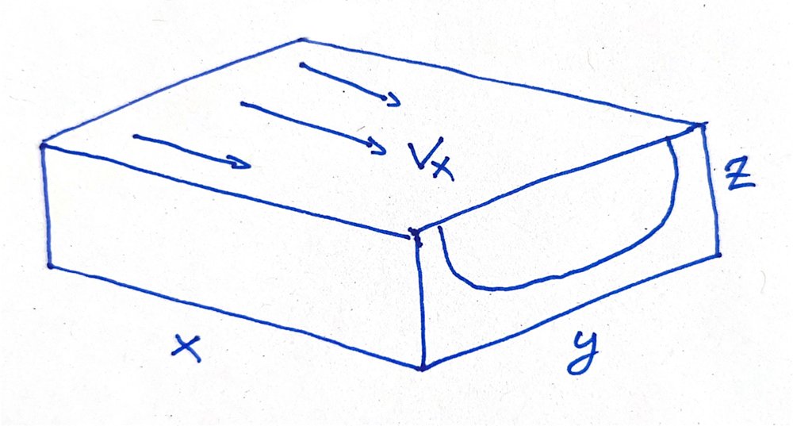
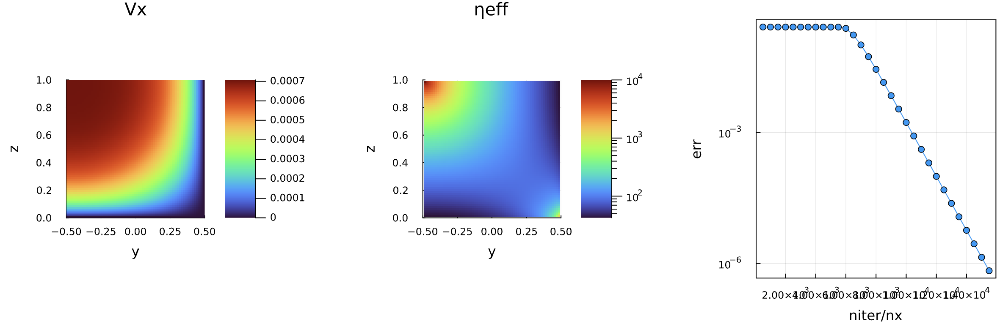

# Galileo23 Master-class 1 - GPU HPC in Julia

[**Solid Earth and Geohazards in the Exascale Era** | BARCELONA | SPAIN | 23–26 MAY 2023](https://egu-galileo.eu/gc11-solidearth/)

#### Master class on GPU HPC for the exascale era in geosciences

_by Ludovic Räss and Ivan Utkin (ETH Zurich)_

:eyes: **ATTENTION:** The content was just updated, make sure to `git pull` before getting started!

## Program
| Slot    | Program |
| :-----  | :----- |
| [Slot 1](#slot-1)  | **Introduction** about GPU HPC<br>- Student short presentation (5 min each) <br>- [Getting started](#getting-started) with GPU node access on `octopus`<br>- Brief intro about Julia for HPC |
| [Slot 2](#slot-2) | **Hands-on I**<br>- GPU computing and HPC<br>- Julia GPU and MPI stack<br>- Model design and implementation: Stokes flow in a channel |
| [Slot 3](#slot-3) | **Hands-on II**<br>- Multi-GPU computing<br>- Performance limiters<br>- Performance measure $T_\mathrm{eff}$ |
| [Slot 4](#slot-4) | **OPTION 1 - Towards scalable inverse modelling**<br>- AD (GPU) tools in Julia<br>- Jacbian-vector product (JVP) computation in a multi-GPU model<br><br>- _Advanced 1: towards sensitivity kernels and adjoint solutions_<br>- _Advanced 2: the accelerated pseudo-transient method_<br><br>  **Wrap-up discussion** |

## Content
- [Slot 1 - Intro](#slot-1)
- [Slot 2 - Hands-on I](#slot-2)
- [Slot 3 - Hands-on II](#slot-3)
- [Slot 4 - OPTION 1](#slot-4)

## Slot 1
### Getting started
This section provides directions on getting your GPU HPC dev environment ready on the `octopus` supercomputer at the University of Lausanne, Switzerland. During this Master-class, we will use SSH to login to a remote multi-GPU compute node on `octopus`. Each of the participant should get access to 4 Nvidia Titan Xm 12GB. 

> ⚠️ It is warmly recommended trying to perform the Getting started steps before the beginning of the workshop.

<details>
<summary>CLICK HERE for the getting started steps 🚀</summary>
<br>

In the following, we will give directions on how to use [VSCode](https://code.visualstudio.com) and the [Remote-SSH](https://marketplace.visualstudio.com/items?itemName=ms-vscode-remote.remote-ssh) extension to access the compute resources. However, feel free to access the resources using your preferred SSH setup.

1. Download [VSCode](https://code.visualstudio.com/download) and [Julia](https://julialang.org/downloads/) on your laptop.
2. Install the [Remote-SSH](https://marketplace.visualstudio.com/items?itemName=ms-vscode-remote.remote-ssh) and [Julia](https://marketplace.visualstudio.com/items?itemName=julialang.language-julia) extensions by clicking the `Extensions` button on the left side of VSCode.
3. Retrieve your **confidential** login credentials from the email you received titled "MC1 login credentials", namely your username `<username>` (in the format `courseXX`) and dedicated compute node ID `<nodeID>` (in the format `nodeXX`).
4. Setup a password-less SSH config to access `octopus` (see e.g. [here](https://linuxize.com/post/how-to-setup-passwordless-ssh-login/) on "how-to"). Ideally, use `ed25519` encryption.
5. [Edit the SSH config file](https://code.visualstudio.com/blogs/2019/10/03/remote-ssh-tips-and-tricks#_ssh-configuration-file) to add the infos about `octopus` login (replacing `<username>` with the username you got assigned - note the node ID should always be a 2 digit number):
    ```
    Host octo-login
      HostName achsrv0.unil.ch
      User <username>
      IdentityFile ~/.ssh/id_ed25519

    Host node<nodeID>
      HostName node<nodeID>.octopoda
      User <username>
      ProxyJump octo-login
    ```
6. Connect to your assigned node, check you are in your home folder (using `pwd`) and clone this repo into your home:
    ```
    git clone https://github.com/PTsolvers/Galileo23-MC1-GPU.git
    ```
    Move to the directory:
    ```
    $cd Galileo23-MC1-GPU
    ```
7. Launch Julia using the `Command Palette` of VSCode `>Julia: Start REPL`. Note that the following modules got loaded automatically:
    ```
    module load julia cuda/11.4 openmpi/gcc83-314-c112
    ```
8. In Julia, type `]` to enter the "package-mode". There, activate the current project and resolve the packages we will need typing:
    ```julia-repl
    (@v1.9) pkg> activate .
    
    (@Galileo23-MC1-GPU) pkg> instantiate
    ```
9. To make sure you are all set, check your CUDA and MPI install:
    ```julia-repl
    julia> using CUDA, MPI

    julia> CUDA.versioninfo()
    CUDA runtime 11.2, local installation
    CUDA driver 12.1
    NVIDIA driver 530.30.2
    
    # [skipped lines]
    
    4 devices:
      0: NVIDIA GeForce GTX TITAN X (sm_52, 11.918 GiB / 12.000 GiB available)
      1: NVIDIA GeForce GTX TITAN X (sm_52, 11.918 GiB / 12.000 GiB available)
      2: NVIDIA GeForce GTX TITAN X (sm_52, 11.918 GiB / 12.000 GiB available)
      3: NVIDIA GeForce GTX TITAN X (sm_52, 11.918 GiB / 12.000 GiB available)
    
    julia> MPI.MPI_LIBRARY_VERSION_STRING
    "Open MPI v3.1.4, package: Open MPI root@node01.octopoda Distribution, ident: 3.1.4, repo rev: v3.1.4, Apr 15, 2019\0"
    ```
10. Let's try now to run some basic plotting scripts within Julia and get the output inlined to VSCode. For this, you need to install the [Julia](https://marketplace.visualstudio.com/items?itemName=julialang.language-julia) extension on the node (as you did already on your laptop) and start Julia using the `Command Palette` of VSCode (`>Julia: Start REPL`). Change to the correct directory using the "shell mode" of Julia (by typing `;` in the REPL):
    ```julia-repl
    shell> cd Galileo23-MC1-GPU/scripts_start/
    /home/courseN/Galileo23-MC1-GPU/scripts_start
    ```
    In the [scripts_start](scripts_start) folder, run the [scripts_start/visu_2D.jl](scripts_start/visu_2D.jl) script as:
    ```julia-repl
    julia> include("visu_2D.jl")
    ```
    which should produce a heatmap of a Gaussian distribution in 2D.
11. Finally, you should at this stage be able to run the following scripts to make sure MPI-based GPU selection and GPU-aware MPI is running as expected in Julia. Exit Julia and go to the [scripts_start](scripts_start) folder:
    ```
    cd scripts_start
    ```
    Run the [scripts_start/hello_mpi_gpu.jl](scripts_start/hello_mpi_gpu.jl) script to make sure GPU selection works as expected:
    ```
    mpirun -np 4 -mca btl_openib_warn_default_gid_prefix 0 julia --project hello_mpi_gpu.jl
    ```
    Run the [scripts_start/alltoall_mpi_gpu.jl](scripts_start/alltoall_mpi_gpu.jl) script to verify GPU-aware MPI is working:
    ```
    mpirun -np 4 -mca btl_openib_warn_default_gid_prefix 0 julia --project alltoall_mpi_gpu.jl
    ```

If you made it here you should be all set :rocket:

#### The small print
Note that the following config is already set in your `.bashrc` to prepare the correct environment:
```sh
# User specific aliases and functions
# load modules
module load julia cuda/11.4 openmpi/gcc83-314-c112
# Julia setup
alias juliap='julia --project'
# new Preferences.jl based config
export JULIA_LOAD_PATH="$JULIA_LOAD_PATH:/soft/julia/julia_prefs/"
export JULIA_CUDA_MEMORY_POOL=none
```
<br>
</details>

### Useful resources
- The Julia language: [https://julialang.org](https://julialang.org)
- PDE on GPUs ETH Zurich course: [https://pde-on-gpu.vaw.ethz.ch](https://pde-on-gpu.vaw.ethz.ch)
- Julia Discourse (Julia Q&A): [https://discourse.julialang.org](https://discourse.julialang.org)
- Julia Slack (Julia dev chat): [https://julialang.org/slack/](https://julialang.org/slack/)

### Julia and HPC
Some words on the Julia at scale effort, the Julia HPC packages, and the overall Julia for HPC motivation (two language barrier)

#### The (yet invisible) cool stuff
Today, we will develop code that:
- Runs on graphics cards using the Julia language
- Uses a fully local and iterative approach (scalability)
- Retrieves automatically the Jacobian Vector Product (JVP) using automatic differentiation (AD)
- (All scripts feature less than 400 lines of code)

Too good to be true? Hold on 🙂 ...

#### Why to still bother with GPU computing in 2023
- It's around for more than a decade
- It shows massive performance gain compared to serial CPU computing
- First exascale supercomputer, Frontier, is full of GPUs


#### Performance that matters


Taking a look at a recent GPU and CPU:
- Nvidia Tesla A100 GPU
- Nvidia Titan Xm GPU
- AMD EPYC "Rome" 7282 (16 cores) CPU

| Device         | TFLOP/s (FP64) | Memory BW TB/s | Imbalance (FP64)     |
| :------------: | :------------: | :------------: | :------------------: |
| Tesla A100     | 9.7            | 1.55           | 9.7 / 1.55  × 8 = 50 |
| AMD EPYC 7282  | 0.7            | 0.085          | 0.7 / 0.085 × 8 = 66 |

**Meaning:** we can do about 50 floating point operations per number accessed from main memory.
Floating point operations are "for free" when we work in memory-bounded regimes.

👉 Requires to re-think the numerical implementation and solution strategies

Unfortunately, the cost of evaluating a first derivative $∂A / ∂x$ using finite-differences:
```julia
q[ix] = -D * (A[ix+1] - A[ix]) / dx
```
consists of:
- 1 reads + 1 write => $2 × 8$ = **16 Bytes transferred**
- 1 (fused) addition and division => **1 floating point operations**

👉 assuming $D$, $∂x$ are scalars, $q$ and $A$ are arrays of `Float64` (read from main memory)

#### Performance that matters - an example
Not yet convinced? Let's have a look at an example.

Let's assess how close from memory copy (1355 GB/s) we can get solving a 2D diffusion problem on an Nvidia Tesla A100 GPU.

$$ ∇⋅(D ∇ C) = \frac{∂C}{∂t} $$

👉 Let's test the performance using a simple [scripts_s1/perftest.jl](scripts_s1/perftest.jl) script.

#### Why to still bother with GPU computing in 2022
Because it is still challenging

Why?
- Very few software uses it efficiently
- It requires to rethink the solving strategy as non-local operations will kill the fun

## Slot 2
**Hands-on I**
Now it's time to get started. In the coming 2 hours, we will program a 2D transientdiffusion equation in a vectorised fashion in Julia. Then, we will turn it into a multi-threaded loop version, and finally into a GPU code. The last part will consist of modifying the diffusion code to solve the channel flow in 2D with free-surface and variable viscosity.

### Solving transient 2D diffusion on the CPU I
Starting from the [scripts_start/visu_2D.jl](scripts_start/visu_2D.jl) script, create a new script `diffusion_2D.jl` where we will add diffusion physics:

$$ \frac{∂C}{∂t} = -∇⋅q~, $$

$$ q = -D~∇C ~, $$

where $D$ is the diffusion coefficient.

Let's use a simple explicit forward Euler time-stepping scheme and keep the same Gaussian distribution as initial condition.

The diffusion coefficient $D = d_0$ should be defined in all gird points such that it could be spatially variable in a later stage:
```julia
D = d0 .* ones(...)
```
> :bulb: If you struggle getting started, check-out the [scripts_s2/diffusion_2D.jl](scripts_s2/diffusion_2D.jl) script and try replacing the `??` by some more valid content.

### Solving  transient 2D diffusion on the CPU II
We will perform one additional step in order to make our code closer to be ready for kernel programming on GPUs.

We will here isolate the lines that perform the actual computations, i.e., solve the PDE, and move those operations into functions. To avoid race conditions and keep correct synchronisation, we need to define 2 different compute functions, one for assigning the fluxes (`update_q!`) and one for updating the values of $C$ (`update_C!`).

> :bulb: Note the exclamation mark `!` in the function name. This is a Julia convention if the function modifies the arguments passed to it.

Create a new script, `diffusion_2D_fun.jl`, where you will use the following template for the compute functions:
```julia
function update_q!()
    Threads.@threads for iz = 1:size(C, 2)
        for iy = 1:size(C, 1)
            if (iy <= ?? && iz <= ??) qy[iy, iz] = ?? end
            if (iy <= ?? && iz <= ??) qz[iy, iz] = ?? end
        end
    end
    return
end
```

The `Threads.@threads` in front of the outer loop allows for shared memory parallelisation on the CPU (aka [multi-threading](https://docs.julialang.org/en/v1/manual/multi-threading/)) if Julia is launched with more than one thread.

Perform the similar tasks for `update_C!` function.

Also, replace the averaging helper functions my macros, and use macros as well to define helper functions for performing the derivative operations.

> :bulb: If you run out of ideas, check-out the [scripts_s2/diffusion_2D_fun.jl](scripts_s2/diffusion_2D_fun.jl) script and try replacing the `??` by some more valid content.

### Solving transient 2D diffusion on GPU
Let's now move to GPU computing. Starting from the [diffusion_2D_fun.jl](scripts_s2/diffusion_2D_fun.jl) script you just finalised, we'll make it ready for GPU execution.

In a new script `diffusion_2D_cuda.jl`, we first need to modify the compute functions (or kernels hereafter) to replace the spatial loops by 2D vectorised indices that will parallelise the execution over many GPU threads:
```julia
function update_q!()
    iy = (blockIdx().x - 1) * blockDim().x + threadIdx().x
    iz = (blockIdx().y - 1) * blockDim().y + threadIdx().y
    ??
    return
end
```
Then, in the `# numerics` section, we need to define some kernel launch parameters to specify the number of parallel workers to launch on the GPU:
```julia
nthreads = (16, 16)
nblocks  = cld.((ny, nz), nthreads)
```
You'll find more details about GPU kernel programming in the [CUDA.jl](https://github.com/JuliaGPU/CUDA.jl) documentation or on [this course website](https://pde-on-gpu.vaw.ethz.ch).

In the `# init` section, we will have now to specify that the arrays should be "uploaded" to the GPU. The `C` init can be wrapped by `CuArray()`. The fluxes and `D` array can be initialised on the GPU by adding `CUDA.` before `ones` or `zeros`. Also, one needs to specify the arithmetic precision as we want to perform double precision `Float64` computations, e.g., `CUDA.zeros(Float64, nx, ny)`.

The kernel launch configuration and synchronisation need to be passed to the kernel launch call as following: 
```julia
CUDA.@sync @cuda threads=nthreads blocks=nblocks update_q!()
```

Finally, one needs to gather back on the host the `C` array for plotting, resulting in calling `Array(C)`.

> :bulb: If you run out of ideas, check-out the [scripts_s2/diffusion_2D_cuda.jl](scripts_s2/diffusion_2D_cuda.jl) script and try replacing the `??` by some more valid content.

### Channel flow in 2D
The final step is to now turn the diffusion script into a channel flow script with non-linear viscosity and a free-surface.



We consider the shear-driven Stokes flow with power-law rheology in a quasi-2D setup:

$$ \frac{\partial \tau_{xy}}{\partial y} + \frac{\partial\tau_{xz}}{\partial z} + \rho g\sin\alpha = 0 $$

$$ \tau_{ij} = 2\eta \varepsilon_{ij}, \quad \varepsilon_{ij} = \frac{1}{2}\left(\frac{\partial v_i}{\partial x_j} + \frac{\partial v_j}{\partial x_i} \right) $$

$$ \eta = k \varepsilon_\mathrm{II}^{n-1} $$

Modify the diffusion script to turn it into a free-surface channel flow. To this end, following changes are necessary:
- the flux become the viscous stresses $τ_{ij}$
- the quantity $C$ becomes the out-of-plane velocity $v_x$
- $\rho g\sin\alpha$ needs to be added as source term to the flux balance equation
- the diffusion coefficient $D$ turns now into the nonlinear viscosity $η$
- the force-balance equation can be used to retrieve $v_x$ iteratively.

For the iterative process can be designed as augmenting the force balance equation with a pseudo-time step $\partial τ$ one can then use to reach a steady state:

$$ \frac{\partial \tau_{xy}}{\partial y} + \frac{\partial\tau_{xz}}{\partial z} + \rho g\sin\alpha = \frac{\partial v_x}{\partial τ} ~.$$

We now have a rule to update $v_x$ as function of the residual of the balance equation $\mathrm{R}v_x$:

$$ \mathrm{R}v_x = \frac{\partial \tau_{xy}}{\partial y} + \frac{\partial\tau_{xz}}{\partial z} + \rho g\sin\alpha~,$$

$$ \frac{\partial v_x}{\partial τ} = \mathrm{R}v_x~,$$

such that:

$$ \partial v_x = \partial v_x + \partial τ * \mathrm{R}v_x~.$$

This simple iterations results in a Picrad-like scheme; simple but not ideal in terms of number of iterations to converge to a given tolerance.

> :eyes: This simple "pseudo-transient" scheme can be accelerated by using a second order scheme. This is on-going research. Check out [this lecture](https://pde-on-gpu.vaw.ethz.ch/lecture3/#solving_elliptic_pdes) and [related publication (Räss et al., 2022)](https://gmd.copernicus.org/articles/15/5757/2022/) if curious about it.

To proceed, start from the `diffusion_2D_fun.jl` script from [this previous step](#solving-transient-2d-diffusion-on-the-cpu-i) and make sure the new physics is correctly implemented. In a second step, we will then port it to GPU kernel programming.

Start a new script titled `channel_flow_2D.jl` or start from the provided [scripts_s2/channel_flow_2D.jl](scripts_s2/channel_flow_2D.jl) script. There, we introduce some new physics parameters:
```julia
# physics
# non-dimensional
npow    = 1.0 / 3.0
sinα    = sin(π / 12)
# dimensionally independent
ly, lz  = 1.0, 1.0 # [m]
k0      = 1.0      # [Pa*s^npow]
ρg      = 1.0      # [Pa/m]
# scales
psc     = ρg * lz
ηsc     = psc * (k0 / psc)^(1.0 / npow)
# dimensionally dependent
ηreg    = 1e4 * ηsc
```
namely, power-law exponent `npow`, slope angle `sinα`, consistency factor `k0`, gravity acceleration `ρg` and some scaling relations.

Then we need some additional numerics parameters:
```julia
# numerics
ϵtol    = 1e-6
ηrel    = 5e-1
maxiter = 20000max(ny, nz)
ncheck  = 500max(ny, nz)
```
namely, the nonlinear tolerance `ϵtol`, some relaxation for the viscosity continuation `ηrel`, and a modification of the iteration parameter definition.

In the `# init` section, rename `C` as `vx`, `D` as `ηeff`, `qy` as `τxy` and `qz` as `τxz`. Also, no longer need to initialise `C` now `vx` with a Gaussian; simply use zeros.

From the equations, we see that the nonlinear viscosity $\eta$ is function of the second strain-rate invariant $ɛ_\mathrm{II}$ at a given power. You can implement `eII` as a macro in the code:
```julia
macro eII() esc(:(sqrt.((avz(diff(vx, dims=1) ./ dy)) .^ 2 .+ (avy(diff(vx, dims=2) ./ dz)) .^ 2))) end
```

Also, we now have to include the `err >= ϵtol` condition in our `while` loop, such that:
```julia
while err >= ϵtol && iter <= maxiter
    # iteration loop
end
```

For the boundary condition, enforce no-slip condition at the bottom and open-box at the top. This can be achieved as following:
```julia
vx[:, end] .= vx[:, end-1]
vx[1, :]   .= vx[2, :]
```

Make finally sure to update the error checking and plotting as well:
```julia
if iter % ncheck == 0
    err = maximum(abs.(diff(τxy, dims=1) ./ dy .+ diff(τxz, dims=2) ./ dz .+ ρg * sinα)) * lz / psc
    push!(iters_evo, iter / nz); push!(errs_evo, err)
    p1 = heatmap(yc, zc, vx'; aspect_ratio=1, xlabel="y", ylabel="z", title="Vx", xlims=(-ly / 2, ly / 2), ylims=(0, lz), c=:turbo, right_margin=10mm)
    p2 = heatmap(yv, zv, ηeff'; aspect_ratio=1, xlabel="y", ylabel="z", title="ηeff", xlims=(-ly / 2, ly / 2), ylims=(0, lz), c=:turbo, colorbar_scale=:log10)
    p3 = plot(iters_evo, errs_evo; xlabel="niter/nx", ylabel="err", yscale=:log10, framestyle=:box, legend=false, markershape=:circle)
    display(plot(p1, p2, p3; size=(1200, 400), layout=(1, 3), bottom_margin=10mm, left_margin=10mm))
    @printf("  #iter/nz=%.1f, err=%1.3e\n", iter / nz, err)
end
```
Running the code should produce a figure similar to:



> :bulb: If you run out of ideas, check-out the [scripts_s2/channel_flow_2D.jl](scripts_s2/channel_flow_2D.jl) script and try replacing the `??` by some more valid content.

In a second step, create now a GPU code titled `channel_flow_2D_cuda.jl` out of the channel flow script using kernel programming. Apply the same workflow as done for the diffusion codes.

On the GPU, we now need 4 kernels to avoid sync issues and ensure correct execution:
```julia
update_ηeff!()
update_τ!()
update_v!()
apply_bc!()
```

> :bulb: If you run out of ideas, check-out the [scripts_s2/channel_flow_2D_cuda.jl](scripts_s2/channel_flow_2D_cuda.jl) script and try replacing the `??` by some more valid content.

## Slot 3
**Hands-on II**
### Multi-CPU diffusion solver

### Multi-GPU diffusion solver

### Multi-GPU channel flow
## Slot 4
**OPTION 1**
### AD tools in Julia
[Automatic differentiation](https://en.wikipedia.org/wiki/Automatic_differentiation) (AD) allows evaluating the gradients of functions specified by code. Using AD, the partial derivatives are evaluated by repeatedly applying the chain rule of differentiation to the sequence of elementary arithetic operations constituting a computer program.

> Many constructs in computer programs aren't differentiable, for example, I/O calls or system calls. AD tools must handle such cases.

Automatic differentiation is a key ingredient of [_differentiable programming_](https://en.wikipedia.org/wiki/Differentiable_programming), a programming paradigm enabling gradient-based optimisation of the parameters of an arbitrary computer program.

Julia has a rich support for differential programming. With the power of tools like [Enzyme.jl](https://enzyme.mit.edu/julia/stable/) it is possible to automatically compute the derivatives of arbitrary Julia code, including the code targeting GPUs. 

### VJP calculations
One of the main building blocks in many optimization algorithms involves computing the vector-jacobian product (JVP). AD tools simplify evaluating JVPs by generating the code automatically given the target function.

Let's familiarise with [Enzyme.jl](https://enzyme.mit.edu/julia/stable/), the Julia package for performing AD.

> There are many other Julia packages for performing AD, e.g., [Zygote.jl](https://fluxml.ai/Zygote.jl/stable/). In this tutorial, we use Enzyme as it supports some features currently missing in other packages, e.g., differentiating mutating functions and GPU kernels.

Let's start with a simple example:

```julia
julia> using Enzyme

julia> f(ω,x) = sin(ω*x)
f (generic function with 1 method)

julia> ∇f(ω,x) = Enzyme.autodiff(Reverse,f,Active,Const(ω),Active(x))[1][2]
∇f (generic function with 1 method)

julia> @assert ∇f(π,1.0) ≈ π*cos(π)

```

In this line: `∇f(x) = Enzyme.autodiff(Reverse,f,Active,Active(x))[1][1]`, we call `Enzyme.autodiff` function, which computes the partial derivatives. We pass `Reverse` as a first argument, which means that we use the reverse mode of accumulation (see below). We mark the arguments as either `Const` or `Active` to specify which partial derivatives are computed.

Let's make more advanced example, differentiating the vector-valued function. We'll use the 1D residual function for the steady-state diffusion:

```julia
function residual!(R,C,dc,dx)
    for ix in 2:length(R)-1
        R[ix] = dc*(C[ix-1] - 2.0 * C[ix] + C[ix+1])/dx^2
    end
end
```

This function mutates it's argument `R`, storing the result of computing the residual in-place. Also, this function is vector-valued, and returns a vector as well. Information about partial derivatives of such functions is describred by its [Jacobian matrix](https://en.wikipedia.org/wiki/Jacobian_matrix_and_determinant).

In [reverse mode](https://enzyme.mit.edu/julia/stable/generated/autodiff/#Reverse-mode) of derivative accumulation, also known as _backpropagation_, one call to Enzyme computes the product of transposed Jacobian matrix and a vector, known as VJP (vector-jacobian product).

To propagate the gradient information, extra storage is needed to store the vector, and the computed derivatives.

```julia
function grad_residual!(R̄,C̄,R,C,dc,dx)
    Enzyme.autodiff(Reverse,residual!,Duplicated(R,R̄),Duplicated(C,C̄),Const(dc),Const(dx))
    return
end
```

Here, we introduced the new parameter activity type, `Duplicated`. The first element of `Duplicated` argument takes the value of a variable, and the second the _adjoint_.

Often the residual computation is split in several functions, or kernels. In that case, the simplest solution is to manually apply the chain rule (better alternative involves defining [custom rules](https://enzyme.mit.edu/julia/stable/generated/custom_rule/), which is out of scope for this tutorial):

$$
\left[\frac{\partial R(q(C))}{\partial C}\right]^\mathrm{T} = \left[\frac{\partial R(q)}{\partial q} \frac{\partial q(C)}{\partial C}\right]^\mathrm{T} = \left[\frac{\partial q(C)}{\partial C}\right]^\mathrm{T} \left[\frac{\partial R(q)}{\partial q}\right]^\mathrm{T} 
$$

Starting from the [scripts_s4/diffusion_1D_enzyme.jl](scripts_s4/diffusion_1D_enzyme.jl), implement the multiple-kernels version of residual evaluation, by replacing the ?? symbols with some meaningful content.

If the residual funciton is a GPU kernel, the syntax is a little bit different:

```julia
function grad_residual!(R̄,C̄,R,C,dc,dx)
    Enzyme.autodiff_deferred(Reverse,residual!,Duplicated(R,R̄),Duplicated(C,C̄),Const(dc),Const(dx))
    return
end
```

> :bulb: Note that we call `autodiff_deferred` instead of `autodiff`.

Try to port the 1D diffusion code with Enzyme to GPU. Use the [scripts_s4/diffusion_1D_enzyme_cuda.jl](scripts_s4/diffusion_1D_enzyme_cuda.jl) as a starting point.

Apply the knowledge to differentiate the residual of the 2D channel flow problem. Use the [scripts_s4/channel_flow_2D_enzyme_cuda.jl](scripts_s4/channel_flow_2D_enzyme_cuda.jl) as a starting point.

### Advanced
#### Towards sensitivity kernels and adjoint solutions

Now, as we know how to compute VJPs using Enzyme, it's time to use the knowledge to compute the sensitivity of the solution, i.e., the velocity, to the steady channel flow problem with respect to changes in effective viscosity.

To quantify the sensitivity, we need to define some metric. We will use the sensitivity kernel definition from [Reuber 2021](https://link.springer.com/article/10.1007/s13137-021-00186-y), which defines the sensitivity kernel as the derivative of the following function with respect to the parameter of interest:

$$
J(v) = \int v
$$

To evaluate the derivative, we can use the chain rule:

$$
\frac{\mathrm{d}J\left(v(η)\right)}{\mathrm{d}η} = \frac{\partial J\left(v(η)\right)}{\partial v} \frac{\mathrm{d}v}{\mathrm{d}\eta}
$$

The tricky term to evaluate is the derivative of the solution to the problem w.r.t. the solution, $\frac{\mathrm{d}v}{\mathrm{d}\eta}$. To compute this derivative, we use the fact that at the steady state the residual of the right-hand side of the system of the equations reaches it's minimum. Taking the derivative of the residual with respect to the viscosity $\eta$ and using the chain rule again, we obtain:

$$
\frac{\mathrm{d}R}{\mathrm{d}\eta} = \frac{\partial R}{\partial v} \frac{\mathrm{d}v}{\mathrm{d}\eta} + \frac{\partial R}{\partial\eta} = 0
$$

Solving for $\frac{\mathrm{d}v}{\mathrm{d}\eta}$ and plugging into the sensitivity kernel, we obtain:

$$
\frac{\mathrm{d}J\left(v(η)\right)}{\mathrm{d}η} = -\frac{\partial J\left(v(η)\right)}{\partial v} \left(\frac{\partial R}{\partial v}\right)^{-1} \frac{\partial R}{\partial\eta}
$$

Directly inverting the matrix $\frac{\partial R}{\partial v}$ is prohibitibvely expensive, but instead we can use the temporary variable, called the _adjoint state_:

$$
\left(\frac{\partial R}{\partial v}\right)^\mathrm{T}\Psi = \frac{\partial J}{\partial v}
$$

$$
\frac{\mathrm{d}J}{\mathrm{d}\eta} = -\Psi^\mathrm{T}\frac{\partial R}{\partial\eta}
$$

In this way, we can compute the point-wise sensitivity in only one additional linear solve. To solve the system of equations $\left(\frac{\partial R}{\partial v}\right)^\mathrm{T}\Psi = \frac{\partial J}{\partial v}$, we can use the same pseudo-transient method that we employed for the forward problem:

$$
\frac{\partial\Psi}{\partial\tau} + \left(\frac{\partial R}{\partial v}\right)^\mathrm{T}\Psi = \frac{\partial J}{\partial v}
$$

To integrate this system in pseudo-time, we need to iteratively apply the transposed jacobian to the adjoint state variable vector. And this is exactly what is computed using the AD!

Extend the 2D channel flow example with the VJP calculation with an iterative loop to update the adjoint variable `v̄` using the same approach as the original problem.

> :bulb: note that in this particular case, $\frac{\partial J}{\partial v}$ = 1

#### The accelerated pseudo-transient method
